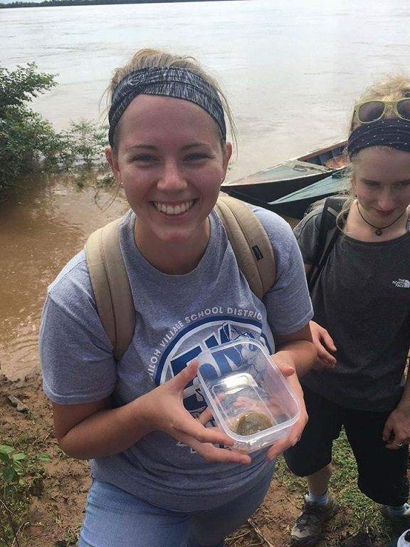
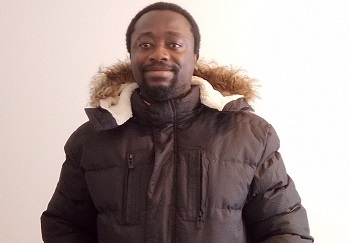
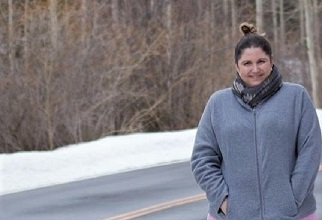
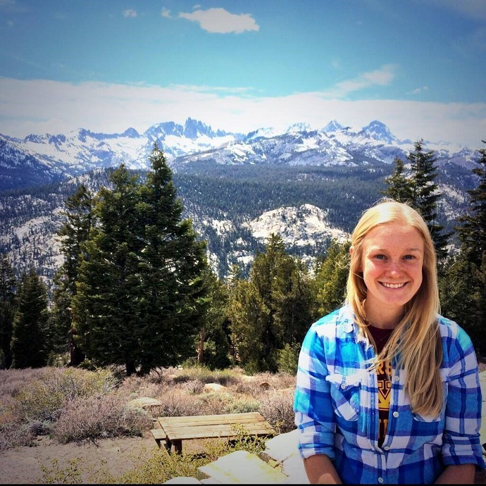

# Graduate Students
**[Home](./index.md)** |

# PhD Students

## Chinedu Nsude

  

**Education:**
* PhD Geography and Environmental Sustainability, University of Oklahoma (2021-present)
* MSc. Ecology and Conservation, University of Aberdeen, United Kingdom (2020)
* B.Tech. Applied Ecology, Abubakar Tafawa Balewa University, Bauchi, Nigeria (2017)

**Research:**
Urban ecology, human-wildlife interaction, sustainable natural resource management

## Claire Burch

  

**Education:**
* PhD Geography and Environmental Sustainability, University of Oklahoma (2020-present)
* MS Environmental Sustainability, University of Oklahoma (2020)
* B.S. Zoology/Environmental Science and Geography minor, Miami University (2016)

**Research:**
Human-environment interactions, renewable energy, human dimensions of natural resource management

## Martin Kusi Manu

  

**Education:**
* PhD Geography and Environmental Sustainability, University of Oklahoma (2022-present)
* M.S. Geo-Information Science and Earth Observation, University of Twente/ Netherlands
* B.S. Natural Resources Management (Wildlife Management), Kwame Nkrumah University of Science and Technology/Ghana
* Diploma Natural Resources Management (Forest Silviculture), Kwame Nkrumah University of Science and Technology/Ghana

**Research:**
Conservation Ecology, GIS, Remote Sensing, Land Use/Land Cover Change, Plant and Animal Distribution 

# Masters Students

## Kari Goold

  

**Education:**
* M.S. Geography, University of Oklahoma (2021-present)
* BA in Anthropology with Minors in Criminal Justice and Sociology from the University of Nevada, Las Vegas (2021)

**Research:**
Geospatial technologies

## Katherine Ho

  

**Education:**
* M.S. Geography and Environmental Sustainability, University of Oklahoma (2021)
* B.S. in Geographic Information Science, minors in Economics and Geology, University of Oklahoma (2019)

**Research:**
GIS, time geography, geospatial technology

## Lora LaPree

  

**Education:**
* MS Geography, University of Oklahoma (2019)
* B.S. Geography-Resource & Environmental Studies, Anthropology; Texas State

**Research:**
GIS, biogeography, wildlife movement

## Monica Mustain

  

**Education:**
* M.S. Geography, Physical Geography, University of Oklahoma (2018)
* B.S. Geology, Illinois State University (2013)

**Research:**
GIS, transportation geography, urban planning, pedestrian network modeling

## Ashley N. Ciarlante

  

**Education:**
* MS Environmental Sustainability, University of Oklahoma (2018)
* BS Wildlife Ecology and Conservation, University of Florida (2011)

**Research:**
GIS, wildlife management, environmental sustainability

## Kelsey Warren-Bryant

  

**Education:**
* MS Environmental Sustainability, University of Oklahoma (2017)
* BA History, University of Sciences and Arts of Oklahoma (2013)

**Research:**
Wildlife ecology, Wildlife management
